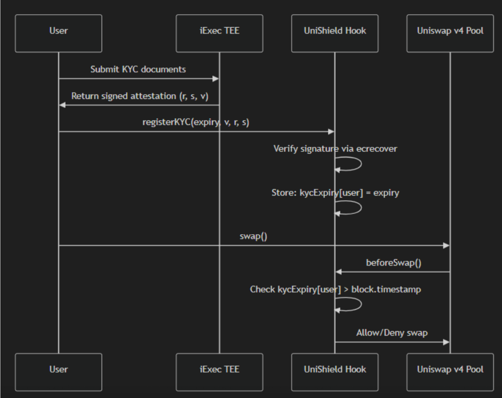

# UniShield

**Privacy-Preserving KYC for DeFi using iExec TEE and Uniswap v4 Hooks**

UniShield enables compliant DeFi liquidity pools where users can prove their KYC status without exposing personal documents on-chain. By combining iExec's Trusted Execution Environment (TEE) with Uniswap v4's hook system, we create a seamless bridge between traditional compliance requirements and decentralized finance.

**[Demo Video](https://youtu.be/6N1Uy2OYJ-w)**

---

## The Problem

DeFi protocols face a critical challenge: **how to meet regulatory KYC requirements without compromising user privacy or decentralization**.

Traditional approaches force users to:
- Share sensitive identity documents with centralized third parties
- Trust that their data won't be misused or leaked
- Undergo repetitive verification for each protocol

This creates friction, privacy risks, and barriers to institutional adoption.


## Our Solution

UniShield solves this with a **privacy-first compliance layer**:

1. **Encrypted Document Processing** - User documents are encrypted client-side and never exposed in plaintext
2. **TEE Verification** - iExec's Trusted Execution Environment processes KYC in an isolated, verifiable enclave
3. **Cryptographic Attestation** - Only a signed proof (not personal data) is recorded on-chain
4. **Hook-Based Enforcement** - Uniswap v4 hooks automatically enforce KYC for all pool interactions

**Result**: Users get verified once, trade freely across all UniShield pools, and their documents remain private.


## Getting Started

### Prerequisites

- Node.js 18+
- Foundry [Only needed if you want to redeploy contracts]

### Environment Variables

Create a `.env` file in the `frontend/` directory:

```bash
VITE_PRIVY_APP_ID=your-privy-app-id
```

Get your Privy App ID from the [Privy Dashboard](https://dashboard.privy.io/).

### Run the project

```bash
cd frontend
npm install
npm run dev
```

---

## Architecture



---


### iExec Integration Details

```
┌─────────────────────────────────────────────────────────────────┐
│                    iExec DataProtector Flow                     │
├─────────────────────────────────────────────────────────────────┤
│  1. protectData()     → Encrypts document with user's key       │
│  2. grantAccess()     → Allows iApp to decrypt in TEE only      │
│  3. processProtectedData() → Triggers TEE execution             │
│  4. TEE validates     → Checks the document                     │
│  5. TEE signs         → Creates attestation with expiry date    │
│  6. Result returned   → User gets (r, s, v) for on-chain use    │
└─────────────────────────────────────────────────────────────────┘
```

The TEE application (`UniShield/src/app.py`) performs the KYC

**No personal data ever touches the blockchain** - only the cryptographic proof.

---

## Technical Stack

| Layer | Technology |
|-------|------------|
| **Smart Contracts** | Solidity, Foundry, Uniswap v4 Hooks |
| **TEE Application** | Python, iExec SDK, DataProtector |
| **Frontend** | React, TypeScript, ethers.js, Privy |
| **Networks** | Ethereum Sepolia (pools), Arbitrum Sepolia (iExec) |

---

### Key Features

- **Signature Verification** - Uses ECDSA to verify TEE-signed attestations
- **Replay Protection** - Tracks used signatures to prevent double-registration
- **Expiry Management** - KYC valid for 30 days, then requires re-verification
- **Emergency Revocation** - Owner can revoke KYC for compliance reasons

---

## Deployed Contracts (Sepolia Testnet)

| Contract | Address |
|----------|---------|
| UniShield Hook | `0xe163dA4E5EAF77c9bBe5b5ebd808B0292C034880` |
| Pool Manager | `0xE03A1074c86CFeDd5C142C4F04F1a1536e203543` |
| cETH Token | `0x7ca9D7C1932442029f53Db9acA0eb43C94279Be8` |
| cUSD Token | `0xfff39C5BCEf87623De00630bD9DB7bf5Be981546` |
| iApp (Arbitrum Sepolia) | `0xe4651C6F9354debbfFF077E1E64b5A6cA00B615D` |

---

## User Journey

### 1. Connect Wallet
Connect via Privy (supports MetaMask, WalletConnect, etc.)

### 2. Complete KYC Verification
- Select document type (Passport, ID Card, Residence Permit)
- Select country
- Upload identity document
- Document encrypted & sent to iExec TEE
- Receive signed attestation

### 3. Register On-Chain
- Attestation registered on UniShield Hook
- KYC valid for 30 days

### 4. Trade & Provide Liquidity
- Access any UniShield pool (only 1 is available right now)
- Add/remove liquidity
- All protected by automatic KYC enforcement

---

## Security Considerations

| Aspect | Implementation |
|--------|----------------|
| **Data Privacy** | Documents encrypted client-side, processed only in TEE |
| **Attestation Authenticity** | ECDSA signatures verified on-chain |
| **Replay Attacks** | Signature hashes tracked to prevent reuse |
| **Compliance** | 30-day expiry enables periodic re-verification |
| **Emergency Controls** | Owner can revoke KYC if required by regulators |

---

## Repository Structure

```
├── solidity/                 # Smart contracts
│   ├── src/
│   │   ├── UniShieldHook.sol    # KYC enforcement hook
│   │   └── CleanTokens.sol      # Test ERC20 tokens
│   └── script/                  # Deployment scripts
│
├── UniShield/                # iExec TEE application
│   ├── src/
│       ├── app.py              # KYC verification logic
│       └── protected_data.py   # Data deserialization
│
└── frontend/                 # React application
    └── src/
        ├── App.tsx             # Main app with KYC flow
        ├── components/
        │   ├── KYCVerification.tsx
        │   └── PoolsPage.tsx
        └── config/
            └── contract.ts     # Contract ABIs & addresses
```

---

## Built For

**iExec Hack4Privacy Hackathon**

UniShield demonstrates how iExec's confidential computing infrastructure can solve real compliance challenges in DeFi while preserving user privacy, a critical requirement for mainstream and institutional adoption.

